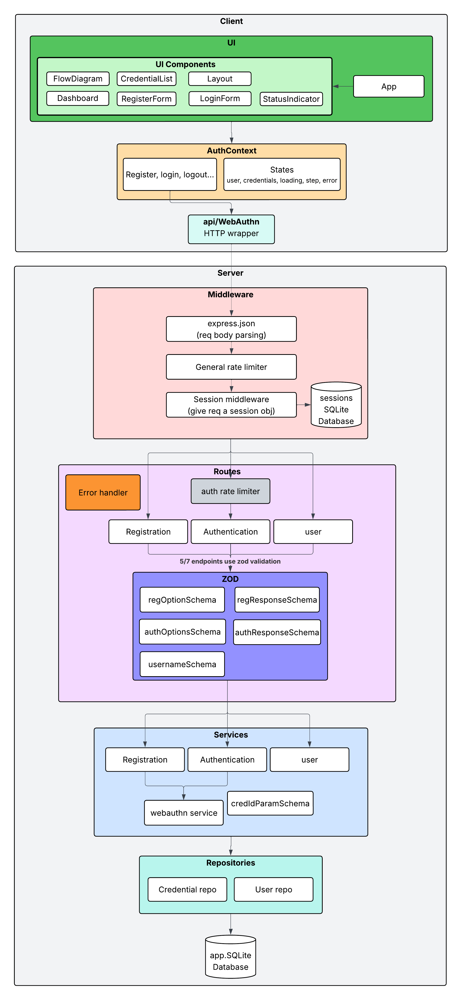

# Biometric Login Showcase

A demo web app showcasing [WebAuthn](https://webauthn.io/) biometric authentication (fingerprint, Face ID, Windows Hello) using:

- **[SimpleWebAuthn](https://simplewebauthn.dev/)** v13 (browser + server)
- **Express 4** + Node.js 20 backend
- **React 18** + Vite + Tailwind CSS frontend
- **SQLite** via `better-sqlite3` for persistence
- **npm workspaces** monorepo

## Quick Start (no Dev Container)
### Start Program

```bash
npm install
npm run dev
```

- Server: `http://localhost:3001`
- Client: `https://localhost:5173` (HTTPS required for WebAuthn)

### Run Tests (no Dev Container)

```bash
npm install
npm run dev
```
## Quick Start (Dev Container)
### Start Program
1. Open project in VS code and click "Reopen in Container" on the pop-up message
2. Inside VS code terminal, run:
```bash
npm run dev
```

### Run Tests
Inside VS Code terminal:
```bash
npm test
```

## Usage

1. Open `https://localhost:5173` (dev container may port forward to 5174) (can take about 30 seconds for app to spin up)
2. Click **Register** and enter a username
3. Browser prompts for your biometric (fingerprint/Face ID/PIN)
4. After registration you're redirected to the Dashboard
5. Click **Sign Out**, then log back in with **Login with Biometric**

## Architecture


